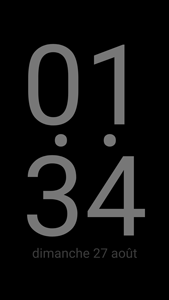
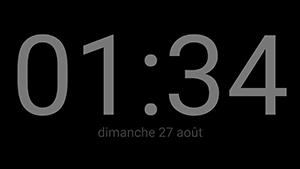

# NightClock

## Description
A Cordova app that displays current time and date in a way suitable to be displayed in the dark in your bedroom.

## Screenshots

## Binaries
Have a look at the [release page](https://github.com/nleclerc/nightclock/releases/).

## License
[GPL v2 or later](LICENSE)
